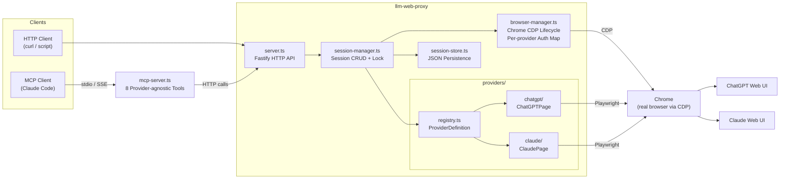
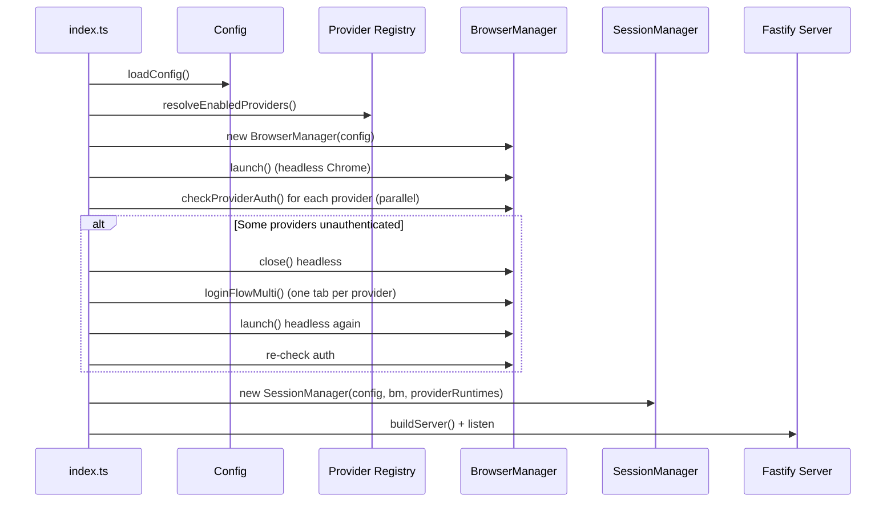
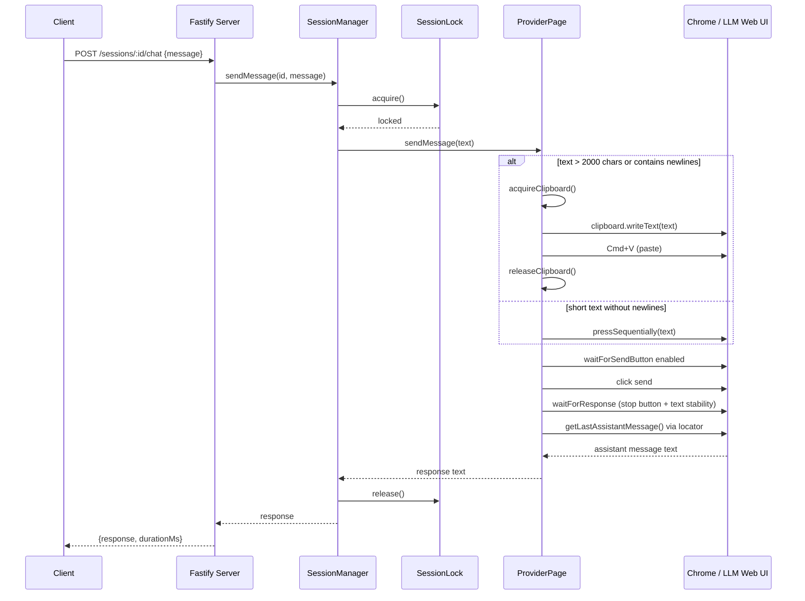
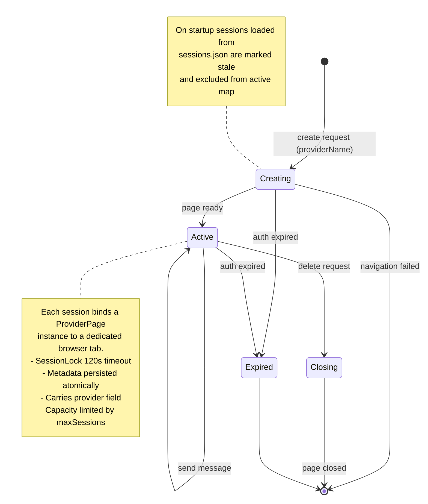

# Architecture

## Component Overview



Key points:
- **Provider Registry** — each provider self-registers via `registerProvider()` at import time; `ProviderDefinition` defines `pageFactory`, `authChecker`, `authExpiredDetector`, and `baseUrl`
- **MCP Server** is a standalone HTTP client — wraps the REST API as 8 provider-agnostic MCP tools, entirely decoupled from session/browser logic
- **BrowserManager** spawns real Chrome via `child_process` + CDP (not Playwright's built-in launch) to bypass Cloudflare; tracks per-provider auth status via `Map<string, boolean>`; supports parallel multi-tab login (`loginFlowMulti`)
- **ProviderPage** (ChatGPTPage / ClaudePage) automates a single browser tab; resolves selectors dynamically with per-instance cache and multiple fallbacks; uses global clipboard mutex for long text or text with newlines
- **SessionManager** holds active sessions in memory with per-session FIFO mutex (`SessionLock` with 120s timeout); each session carries a `provider` field; enforces `maxSessions` capacity limit; persists metadata atomically after each mutation

## Startup Flow



## Request Flow (POST /sessions/:id/chat)



## Session Lifecycle



## Module Dependencies

```
index.ts
  +-- config.ts --- types.ts
  +-- providers/registry.ts --- types.ts
  |     +-- providers/chatgpt/index.ts + page.ts
  |     +-- providers/claude/index.ts + page.ts
  +-- browser-manager.ts --- types.ts, providers/registry.ts (AuthChecker type)
  +-- session-manager.ts
  |     +-- browser-manager.ts
  |     +-- providers/registry.ts (ProviderPageFactory, AuthExpiredDetector)
  |     +-- session-store.ts
  |     +-- errors.ts
  +-- server.ts --- session-manager.ts, browser-manager.ts, errors.ts

mcp-server.ts (standalone, HTTP client only)
  +-- index.ts (startProxy)
```

Leaf modules with zero outgoing deps: `types.ts`, `errors.ts`, `session-store.ts`.

## Runtime Data

All runtime data lives in `.llm-web-proxy/` (gitignored):

```
.llm-web-proxy/
  accounts/default.json   -- Playwright storageState backup (all providers' cookies)
  chrome-profiles/default/ -- Chrome user data directory (shared across providers)
  sessions.json           -- Session persistence (atomic write via temp+rename)
```

Notes:
- `chrome-profiles/*/SingletonLock` is removed on startup to prevent stale lock issues
- All providers share one Chrome profile (cookies are per-domain, no conflict)
- `accounts/*.json` contains login cookies backup; re-run `pnpm run login` or restart to trigger login flow if auth expires
